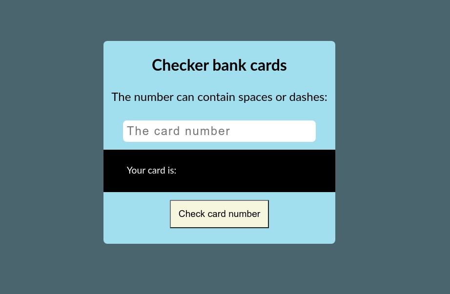

# This is the Credit card checker



## Project description

He can check your credit card number.

## Technologies

-   HTML
-   SCSS
-   JavaScript

## Tools

-   npm
-   parcel-bundler
-   babel
-   sass
-   prettier
-   autoprefixer

## Automation

Automation is built on the basis of bundler prettier and provides the following functionality.

-   live server
-   minification
-   add source maps
-   add prefixes

## Test

-   jest https://jestjs.io/

```bash
npm run test
```

## Installation

```bash
npm install
```

## How to use

Development project:

```bash
npm run start
```

Build a project for publication:

```bash
npm run build
```

Clean:

```bash
npm run clean
```

## Link to the app

https://andrzej-jablonski-project.github.io/Credit-card-checker/
